# Demand Forecasting & Production Planning: Project Report

This report explains how the Demand Forecasting project works from start to finish:
which data goes in, how it is cleaned and combined, which techniques and algorithms
turn it into forecasts, and how those forecasts become production decisions on the
dashboard.

It describes the **method only**. It does not quote any forecast, accuracy result or
fitted value, because those change with every data refresh and are shown live on the
dashboard. Numbers that do appear are **design parameters** of the method, such as the
horizon length or the number of cross-validation folds.

---

## Contents

1. [Project objective](#1-project-objective)
2. [Technology stack](#2-technology-stack)
3. [System architecture](#3-system-architecture)
4. [Module dependency map](#4-module-dependency-map)
5. [Master flowchart: input to output](#5-master-flowchart-input-to-output)
6. [Stage 1: Data acquisition](#6-stage-1-data-acquisition)
7. [Stage 2: Data cleaning and integration](#7-stage-2-data-cleaning-and-integration)
8. [Stage 3: Demand definition and weekly aggregation](#8-stage-3-demand-definition-and-weekly-aggregation)
9. [Stage 4: Festival and sale effect model](#9-stage-4-festival-and-sale-effect-model)
10. [Stage 5: Similar-design graph](#10-stage-5-similar-design-graph)
11. [Stage 6: Feature engineering](#11-stage-6-feature-engineering)
12. [Stage 7: Model training and selection](#12-stage-7-model-training-and-selection)
13. [Stage 8: Recursive multi-step forecasting](#13-stage-8-recursive-multi-step-forecasting)
14. [Stage 9: Cold-start blending for new designs](#14-stage-9-cold-start-blending-for-new-designs)
15. [Stage 10: Post-processing and hierarchy reconciliation](#15-stage-10-post-processing-and-hierarchy-reconciliation)
16. [Stage 11: Product lifecycle classification](#16-stage-11-product-lifecycle-classification)
17. [Stage 12: Inventory and production planning](#17-stage-12-inventory-and-production-planning)
18. [Stage 13: Evaluation and backtesting](#18-stage-13-evaluation-and-backtesting)
19. [Stage 14: Outputs and delivery](#19-stage-14-outputs-and-delivery)
20. [Runtime orchestration and refresh cycle](#20-runtime-orchestration-and-refresh-cycle)
21. [Data model](#21-data-model)
22. [Summary of techniques and algorithms](#22-summary-of-techniques-and-algorithms)
23. [Appendix: code map, API, configuration, running, deployment](#23-appendix)

---

## 1. Project objective

The system predicts **weekly gross demand** for every product for the next
**13 weeks**. It then turns that prediction into **how many units to produce**, given
the finished-goods stock and work-in-progress (WIP) that already exist.

Forecasts are made at two levels, SKU and Style. Sub Category figures are the sum of
their Styles:

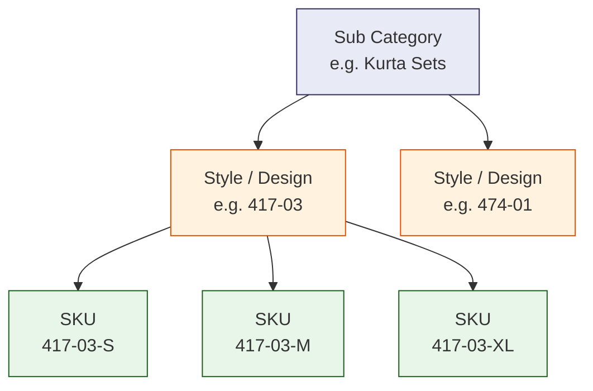

| Level | Unit | Why it is needed |
|---|---|---|
| **SKU** | design + size | Size-level stock and production decisions |
| **Style** | design number (`DESIGN_NO`) | More stable totals for planning at the style level |
| **Sub Category** | sum of its Styles | Category-level view in the report |

Sales channels (Amazon, Flipkart, Myntra, Meesho, Nykaa and the brand websites) are
shown as **actual sales only**. There is no per-channel forecast.

---

## 2. Technology stack

| Layer | Technology |
|---|---|
| Data warehouse | Google BigQuery (sales orders) |
| Operational data | DigiBizz ERP report API (design master, WIP, stock, bill of materials) |
| Catalog metadata | Google Cloud SQL, PostgreSQL (catalog tiers, style images) |
| Backend | Python 3.13, FastAPI, Uvicorn, Pydantic |
| Data processing | pandas, NumPy |
| Machine learning | LightGBM, scikit-learn (metrics) |
| Persistence | JSON forecast snapshots and a SQLite weekly log in `api/.cache/` |
| Frontend | React 19, TypeScript, Vite, Material UI, TanStack Query / Table / Virtual |
| Deployment | Docker, Google Cloud Run (API and dashboard), nginx (serves the dashboard's static files) |

---

## 3. System architecture

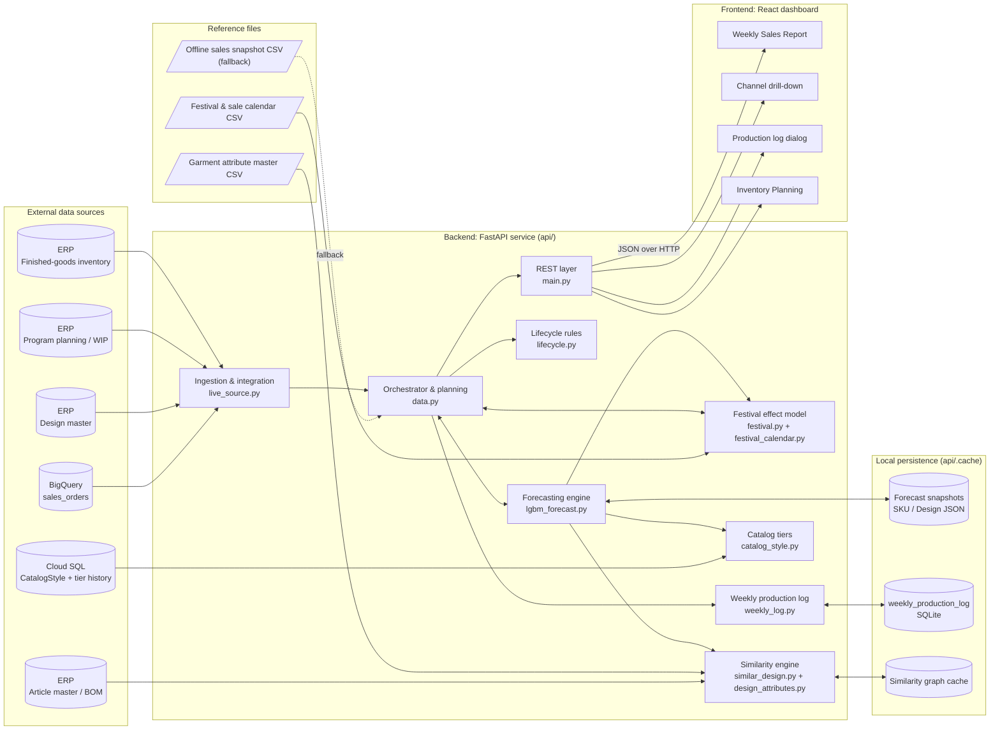

---

## 4. Module dependency map

This diagram shows which backend modules call which. Arrows point from the caller to
the module it uses.

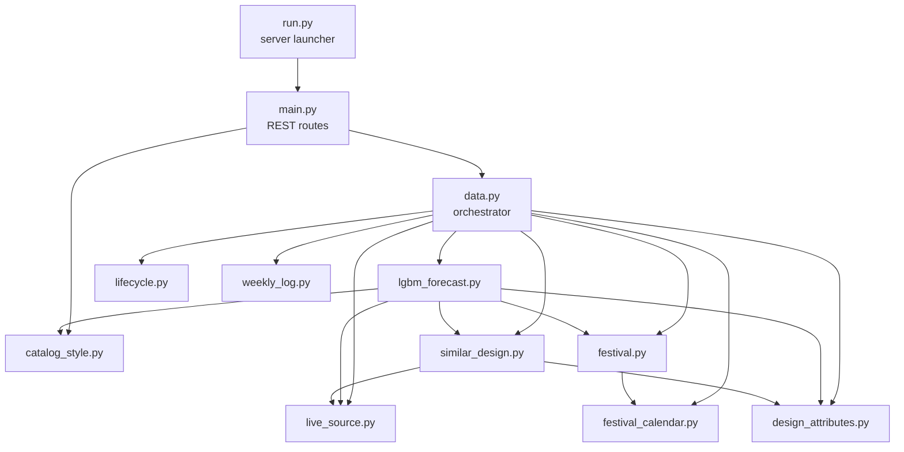

---

## 5. Master flowchart: input to output

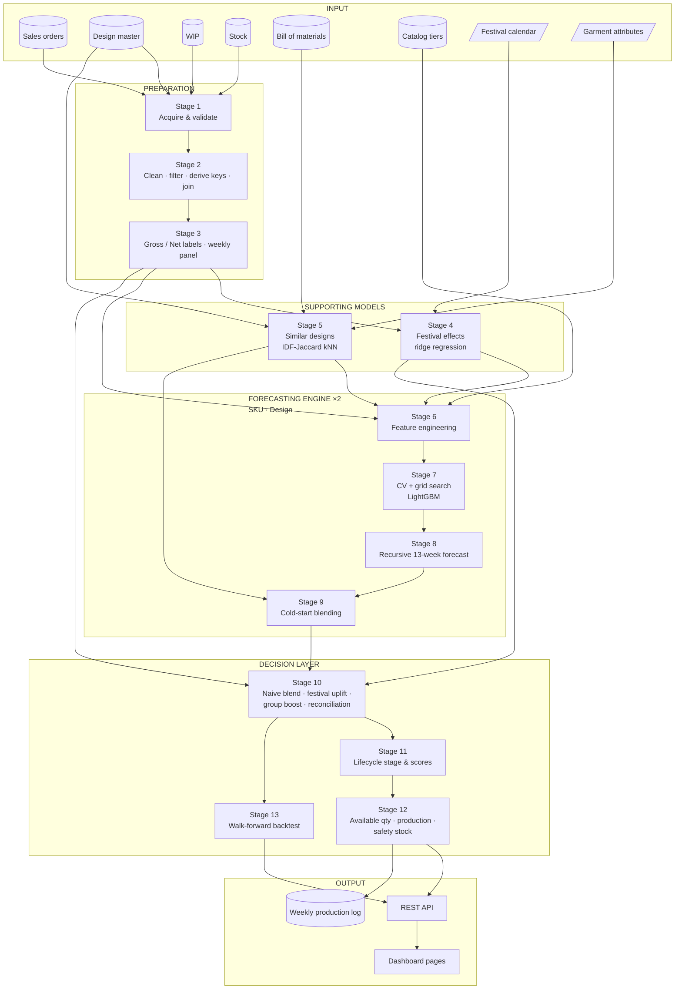

---

## 6. Stage 1: Data acquisition

**Module:** `api/live_source.py` (sales and ERP), `api/similar_design.py` (BOM),
`api/catalog_style.py` (tiers), `api/festival_calendar.py` and
`api/design_attributes.py` (CSV files).

| # | Source | Main fields | Purpose |
|---|---|---|---|
| 1 | BigQuery sales-order table | SKU, listing SKU, quantity, order status, order date, channel, source, buyer state and city, warehouse, value, promotion discount, order and sub-order IDs | Demand history |
| 2 | ERP design master | Design number, group, catalog, colour, section, launch date | Product metadata, product age |
| 3 | ERP program planning | In-house WIP, job-work WIP, allocation, per design + size | Units in production |
| 4 | ERP inventory | Pending pieces (finished goods) per design + size | Units in stock |
| 5 | ERP article master | Raw-material article, article group, designs that use it | Bill-of-materials similarity |
| 6 | Cloud SQL `CatalogStyle` | Current tier, tier change history, images | Catalog tier feature, gallery |
| 7 | Festival calendar CSV | Event name, start date, end date | Festival and sale windows |
| 8 | Garment attribute CSV | Category, sub-category, fabric, colour, embroidery, print, neck, sleeve | Category grouping, fallback similarity |

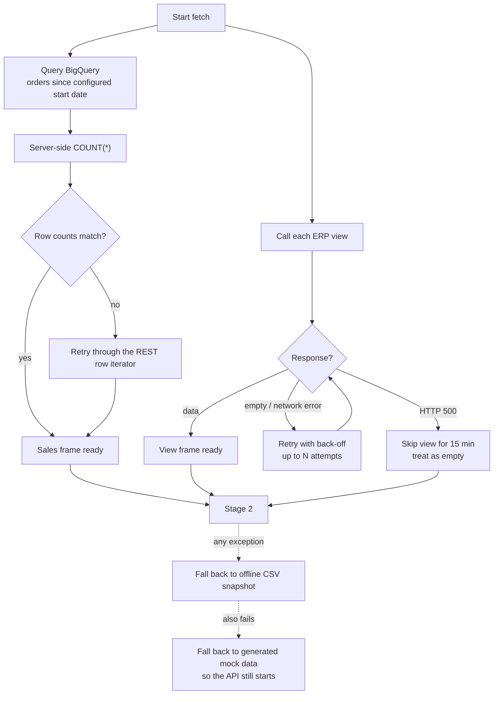

---

## 7. Stage 2: Data cleaning and integration

**Technique:** rule-based filtering, regular-expression key extraction, relational
joins, and de-duplication.

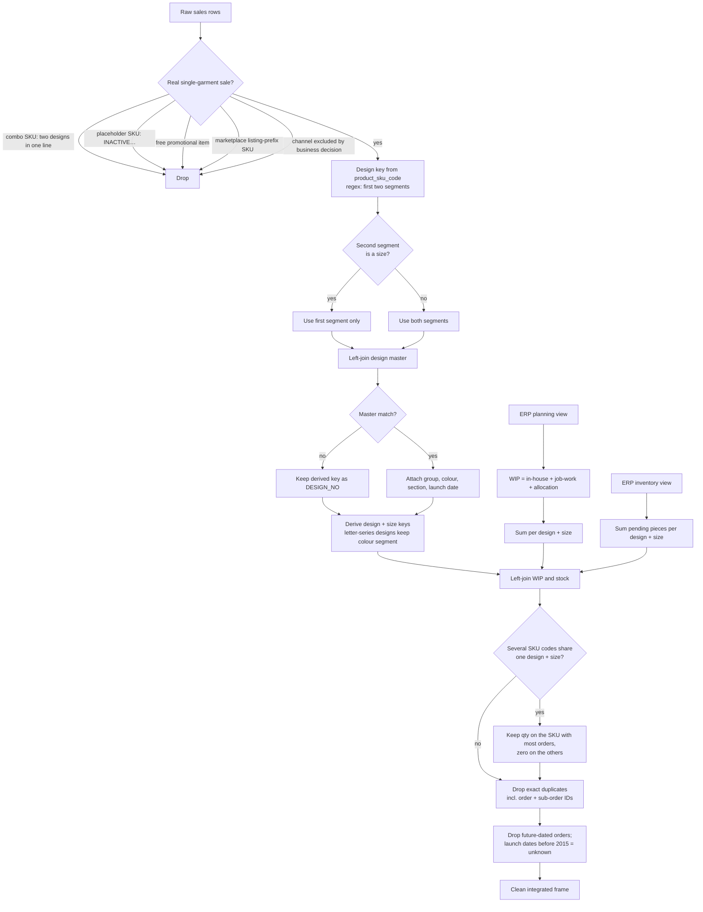

**Key rules**

1. **Junk filtering.** Remove order lines that are not a single real garment: bundles of
   two designs, unresolved placeholder codes, promotional freebies, marketplace listing
   prefixes, and the excluded channel.
2. **Canonical SKU.** Parse the internal `product_sku_code`, not the per-marketplace
   listing code, because the internal code follows a consistent `DESIGN-SIZE` pattern.
3. **Design key examples:**
   - `417-03-XL` → design `417-03`, size `XL`
   - `6302-L` → design `6302`, size `L`
   - `K-108-01-32` → design `K-108-01`, size `32`
4. **No lost sales.** A design with no master record keeps its derived key, so its sales
   still appear.
5. **No double counting.** When several SKU codes map to the same design + size, the
   stock and WIP for that design + size are assigned to one SKU only.
6. **True de-duplication.** Rows are de-duplicated on the full row, including the
   marketplace order IDs, so two genuinely different orders are never merged.

---

## 8. Stage 3: Demand definition and weekly aggregation

**Technique:** status-based labelling, calendar bucketing, and dense panel construction.

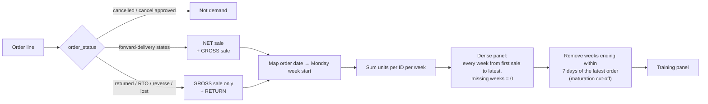

| Label | Meaning | Used for |
|---|---|---|
| **Gross sale** | Every order that was actually placed, including ones later returned. Only cancellations are excluded | **Training target**, naive baseline, festival fitting, evaluation, reported "Actual Sale" |
| **Net sale** | Orders still moving forward to delivery | Lifecycle velocity, safety-stock variability, geography rankings |
| **Return** | Return-type statuses | Lifecycle return-rate score |

- **Maturation.** Order statuses keep updating for several days after a sale, so the
  most recent weeks are incomplete. They are left out of training until their actuals
  have settled.
- **Dense panel.** Weeks with no sales appear as explicit zeros, so the model sees how
  intermittent the demand is.

---

## 9. Stage 4: Festival and sale effect model

**Module:** `api/festival.py`.

**Technique:** log-linear **ridge regression** that estimates the effect of every event
type together, measured against a same-weekday baseline.

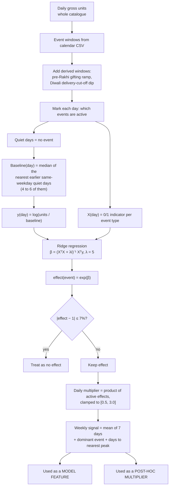

**Why this approach**

- **Same-weekday baseline.** Comparing each day with the same weekday removes the normal
  weekly shopping pattern from the measurement.
- **Log-linear model.** Taking the log turns overlapping multiplicative effects into a
  sum. Fitting all events together separates the effect of each one when several run at
  the same time.
- **Ridge penalty.** Pulls rarely-seen events towards "no effect", so a few noisy days
  cannot create a large multiplier.
- **Dips are allowed.** Multipliers below 1 capture festivals when shoppers buy less
  online.
- **Re-fitted every refresh.** New festival seasons update the effects automatically. If
  there is too little history, the previous effects are kept.

---

## 10. Stage 5: Similar-design graph

**Modules:** `api/similar_design.py` (primary), `api/design_attributes.py` (fallback).

**Technique:** **k-nearest-neighbour** retrieval with **IDF-weighted Jaccard
similarity**, using an inverted index so only designs that share a material are
compared.

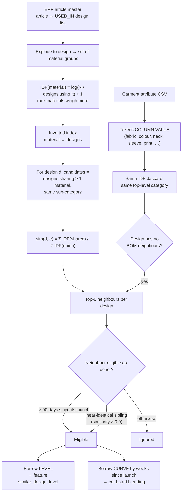

**Idea.** A design's bill of materials (fabric, embroidery, lace, trims) works as a
fingerprint. Two designs that share rare, specific materials usually belong to the same
collection or aesthetic and tend to sell in a similar way. Designs that have not entered
production have no bill of materials yet, so they fall back to similarity based on
their garment attributes.

---

## 11. Stage 6: Feature engineering

**Module:** `api/lgbm_forecast.py`.

**Technique:** supervised-learning features built from lags, rolling statistics,
calendar fields, categorical attributes and hierarchy signals. Every feature is
**point-in-time**: a training row for a given week sees only information that was known
in that week.

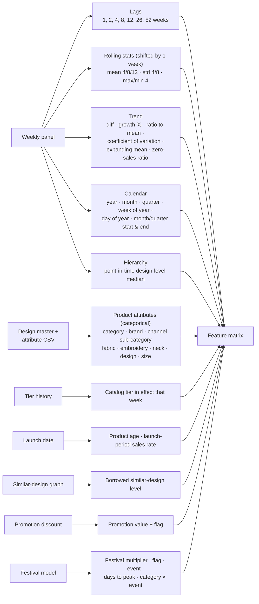

| Group | Purpose |
|---|---|
| Lags | Short-term momentum (1–12 weeks), half-year and yearly seasonality (26, 52 weeks) |
| Rolling statistics | Recent level, volatility and range |
| Trend | Direction of change and how intermittent demand is |
| Calendar | Seasonality inside the year |
| Product attributes | Lets the model share what it learns across similar products |
| Catalog tier | The merchandising team's view of the style, as it stood in that week |
| Lifecycle | Where the product is between launch and maturity |
| Hierarchy | A noisy SKU can lean on its design's more stable signal and on similar designs |
| Promotion | Effect of price discounts |
| Festival | Event uplift or dip |

**Outlier treatment.** Outside festival weeks, each ID's weekly demand is capped at its
own **99th percentile**. The percentile is computed from the training period only, so it
uses no future data. One-off spikes are dampened while real festival spikes are kept.

---

## 12. Stage 7: Model training and selection

**Module:** `api/lgbm_forecast.py`.

**Technique:** gradient-boosted decision trees with a **Tweedie** loss, tuned with
**rolling-origin time-series cross-validation**. The algorithm is **LightGBM**; a grid
search picks its hyperparameters.

**Why Tweedie.** Weekly apparel demand has many zero weeks and occasional large ones. A
Tweedie distribution models this mix of "no sale" and a positive amount directly, and
never predicts negative demand.

### 12.1 Time-series split

```mermaid
gantt
    title Rolling-origin cross-validation (illustrative)
    dateFormat X
    axisFormat %s
    section Fold 1
    Train      :a1, 0, 40
    Validate   :crit, a2, 40, 55
    section Fold 2
    Train      :b1, 0, 55
    Validate   :crit, b2, 55, 70
    section Fold 3
    Train      :c1, 0, 70
    Validate   :crit, c2, 70, 85
    section Hold-out
    Test (last 15% of weeks) :done, d1, 85, 100
```

### 12.2 Training and selection flow

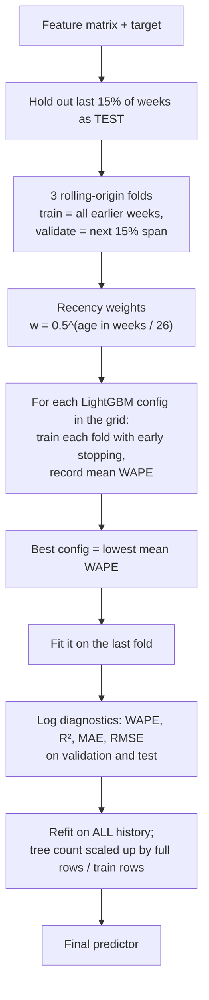

**Search space.** The grid varies tree depth, number of leaves, minimum samples per
leaf, L1/L2 regularisation, row and column subsampling, and the Tweedie variance power.
Every candidate uses a learning rate of 0.04, up to 3,000 trees, and stops early after
50 rounds without improvement.

**Metric.** WAPE (weighted absolute percentage error) = `Σ|actual − forecast| / Σ actual`.
It is weighted by volume, so fast-selling items count for more than rare ones.

### 12.3 The two models

The same engine trains two independent models:

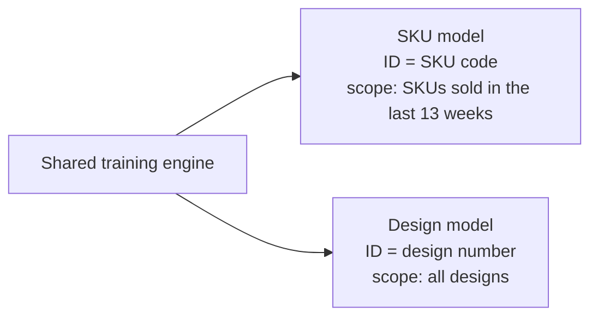

---

## 13. Stage 8: Recursive multi-step forecasting

**Technique:** **recursive (iterated) forecasting.** The model predicts one week ahead,
and that prediction becomes an input for the week after.

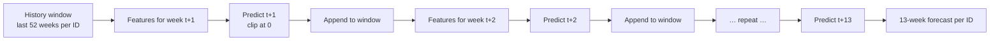

At each of the **13 steps**:

- Lag, rolling and trend features are recomputed from the window, which now includes
  the predictions made so far.
- Calendar and festival features are those of the target week.
- Promotions are set to zero, since future promotions are not known.
- Static features (attributes, tier, hierarchy level, launch date) stay the same.

---

## 14. Stage 9: Cold-start blending for new designs

**Technique:** **confidence-weighted shrinkage** towards an **analogue demand curve**
borrowed from similar designs.

A design with little sales history cannot be forecast reliably from its own data, so
its model forecast is blended with the curve that similar designs followed at the same
age.

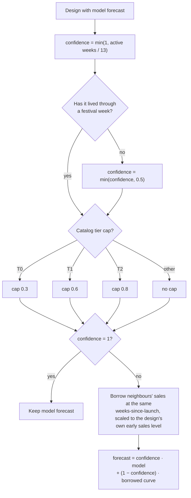

The borrowed curve is aligned by **weeks since launch**, not by calendar date. This lets
a new design pick up a launch ramp, seasonal pattern or festival spike that similar
designs have already been through.

---

## 15. Stage 10: Post-processing and hierarchy reconciliation

**Module:** `api/data.py`.

### 15.1 From raw model output to a published forecast

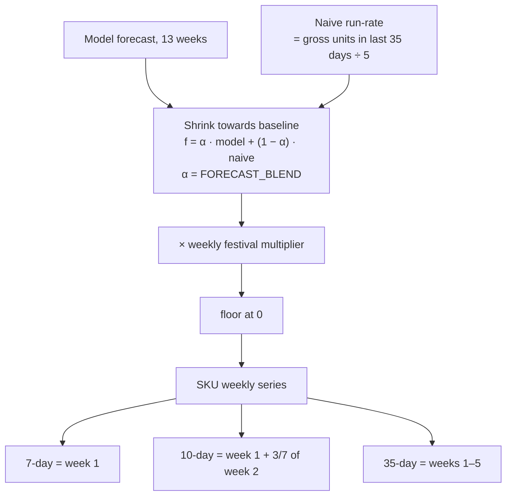

- **Shrinkage towards the naive baseline.** Blending with each item's own recent run-rate
  keeps the model close to that item's actual current level. `α` controls how much
  weight the model gets.
- **Festival multiplier.** Each week is multiplied by the festival signal from Stage 4.
- **Fallback.** Weeks with no model value, or a cold start with no model at all, use
  the naive run-rate × the festival multiplier.

### 15.2 Style and Sub Category rows (Weekly Sales Report)

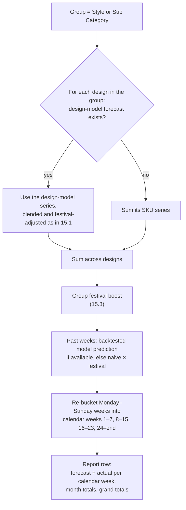

Design-level forecasts are used in preference to adding up SKUs, because a design's
total demand is less noisy than each of its sizes.

### 15.3 Group festival boost

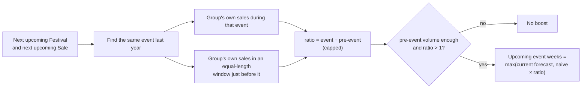

This uses each Style's or Sub Category's own history of how it responded to that event.
It can only **raise** a forecast. When a week falls in both a festival and a sale, the
larger boost wins.

### 15.4 Channel breakdown (actuals only)

Expanding a Style row, or the TOTAL row, shows its **actual gross sales per marketplace**
for each calendar week. No forecast is made at channel level.

Marketplaces are derived from the channel name. Amazon (including Wishlink), Flipkart,
Meesho, Myntra and Nykaa come from the OMS source; the brand websites come from the
WEBSITE source.

---

## 16. Stage 11: Product lifecycle classification

**Module:** `api/lifecycle.py`.

**Technique:** a **rule-based decision system** with **percentile tiering** and
**weighted scoring**. It runs after forecasting and is never used as a model input,
because it describes the current state and would leak future information into training.

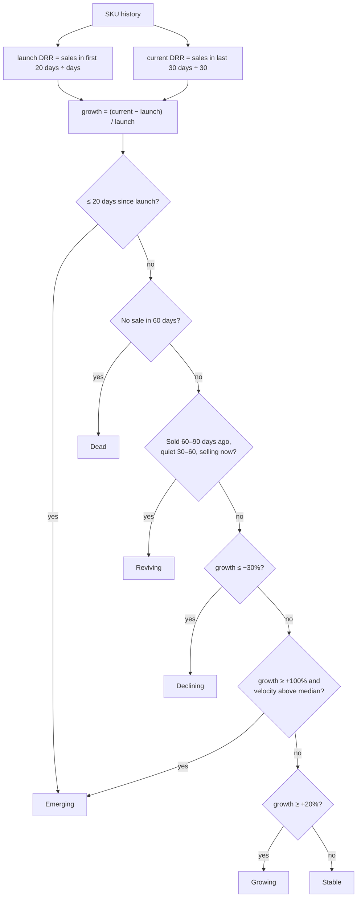

DRR is the daily run rate: average units sold per day.

**Tiers.** Launch and current tiers T0–T3 are assigned using the 40th, 70th and 90th
percentile cut-offs of DRR across active SKUs.

**Scores (0–100)**

| Score | Built from |
|---|---|
| Health | velocity rank, growth rank, stock turnover, how few returns there are, stage |
| Risk | stage, overstock, return rate |
| Production priority | stage, velocity rank, stockout risk |

| Stage | Production factor | Policy |
|---|---|---|
| Emerging | 1.40 | Scale up |
| Growing | 1.25 | Increase production |
| Reviving | 1.15 | Increase cautiously |
| Stable | 1.00 | Match demand |
| Declining | 0.50 | Taper off |
| Dead | 0.00 | Stop |

---

## 17. Stage 12: Inventory and production planning

**Technique:** inventory-position arithmetic and a **statistical safety-stock** formula.

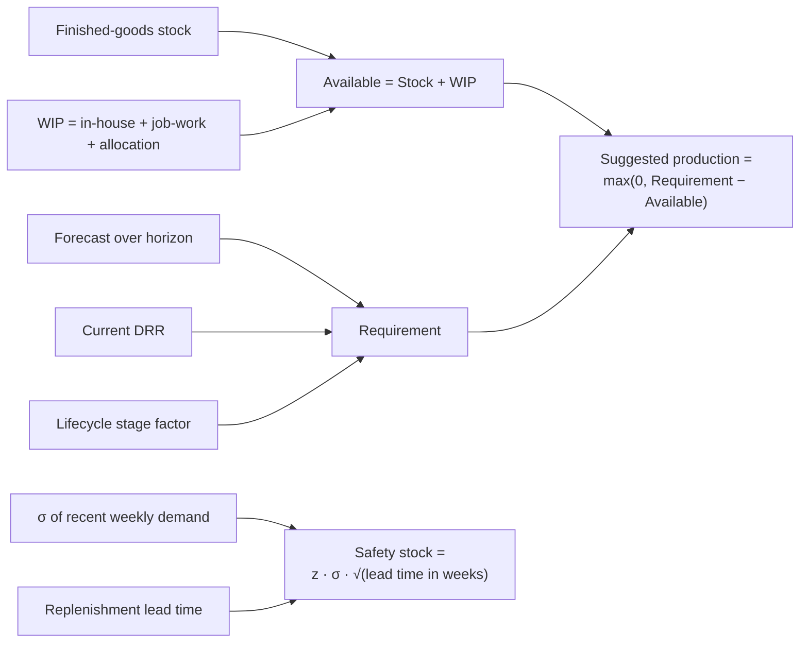

| Output | Formula |
|---|---|
| Available quantity | stock + WIP |
| Produce Now (SKU) | `DRR × 35 − available`, triggered only when available is below the 35-day forecast |
| Stock status | "In Stock" if available ≥ 35-day forecast, otherwise "Needs Production" |
| Lifecycle-adjusted suggestion | `max(0, 35-day forecast × stage factor − available)` |
| Style suggestion (report) | `max(0, forward forecast over the report horizon − available)` |
| Safety stock | `z · σ_weekly · √(lead time in weeks)`; z is the service-level score |
| Days to finish (Inventory page) | `stock ÷ recent daily sales rate`, per design + size |

---

## 18. Stage 13: Evaluation and backtesting

**Technique:** **walk-forward (out-of-time) backtesting**, scored with **WAPE**, plus
the diagnostics logged during training.

```
WAPE     = Σ |actual − forecast| / Σ actual
Accuracy = 1 − WAPE   (volume-weighted, clamped to 0–100%)
```

```mermaid
flowchart TD
    A["Forecast snapshot saved on each training run"] --> B{"Has its first forecast week<br/>ended AND settled for 7 days?"}
    B -- no --> W["Wait for later refreshes"]
    B -- yes --> C["Re-apply the same blend + festival<br/>multiplier as was published"]
    C --> D["Compare with real gross actuals"]
    D --> E["Keep the latest prediction per (ID, week)<br/>so each week counts once"]
    E --> F1["Pooled accuracy"]
    E --> F2["Per-ID accuracy"]
    E --> F3["Latest-week accuracy"]
    E --> F4["Per-catalog-tier accuracy"]
```

| Evaluation | When | What it measures |
|---|---|---|
| Cross-validation WAPE | Every training run | Choosing hyperparameters and the model family |
| Test WAPE, R², MAE, RMSE | Every training run | Performance on held-out weeks |
| Walk-forward backtest | Every rebuild, if `RUN_BACKTEST=1` | How the forecast as actually shown compared with what sold, separately for SKU and design |
| Naive proxy | When the backtest is off | Recent-sales baseline projected over recent weeks, compared with actuals |
| Offline scripts | On demand | Compare method choices on real history |

---

## 19. Stage 14: Outputs and delivery

### 19.1 Outputs

| Output | Contents |
|---|---|
| **SKU plan** | 7, 10 and 35-day forecasts; stock, WIP, available; lifecycle stage, tiers, scores; safety stock; production suggestions; predicted festival spike |
| **Weekly Sales Report** | One row per Style or Sub Category: forecast and actual per calendar week, month and grand totals, available quantity, suggested production, upcoming festival and sale outlook |
| **Channel drill-down** | Actual sales per marketplace per week, for one Style or the filtered total |
| **Style lifecycle panel** | Styles that sold last year vs styles launched this year, per Sub Category |
| **Inventory Planning** | Stock, daily run rate and days to finish per design + size |
| **Weekly production log** | For each Style and report week: the forecast recorded at the start of the week, the suggestion while the week runs, and the actual sales once it ends |

### 19.2 Delivery path

```mermaid
flowchart LR
    MEM["In-memory plan<br/>& forecasts"] --> CACHE["Response caches<br/>keyed by data version + date"]
    CACHE --> API["FastAPI endpoints<br/>JSON"]
    API --> RQ["React Query cache<br/>(browser)"]
    RQ --> W["Weekly Sales Report page"]
    RQ --> C["Channel drill-down rows"]
    RQ --> PL["Production log dialog"]
    RQ --> INV["Inventory Planning page"]
    W --> EXP["Export to file"]
```

### 19.3 Weekly production log lifecycle

```mermaid
stateDiagram-v2
    [*] --> Open: week starts - record forecast and suggestion
    Open --> Open: data refresh - update outlook and suggestion
    Open --> Completed: week ends - fill actual sales and lock
    Completed --> Removed: older than latest 8 completed weeks
    Removed --> [*]
```

---

## 20. Runtime orchestration and refresh cycle

The whole pipeline runs **on startup**, **every day at 06:00** and **on demand** (the
dashboard's Refresh button). It is designed so users always see a model-based forecast
and never have to wait for training.

```mermaid
sequenceDiagram
    autonumber
    actor User
    participant UI as Dashboard
    participant API as FastAPI
    participant D as data.rebuild()
    participant L as live_source
    participant F as festival
    participant C as Forecast cache
    participant T as Background trainer
    participant W as weekly_log

    Note over D: Triggered at startup, 06:00 daily,<br/>or POST /admin/refresh
    D->>L: assemble()
    L-->>D: clean integrated frame (or CSV fallback)
    D->>F: calibrate(daily gross units)
    D->>C: newest saved SKU / design forecasts
    C-->>D: forecasts ≤ 28 days old, shifted to align weeks
    D->>D: build plan (Stages 10–12), publish in one step
    D->>D: warm response caches
    User->>UI: open report
    UI->>API: GET /api/reports/weekly-grid
    API-->>UI: JSON (served immediately)
    alt today's forecasts not trained yet
        D->>T: start training thread
        T->>T: SKU model (Stages 6–9)
        T->>T: Design model (Stages 6–9)
        T->>C: save snapshots
        T->>D: rebuild plan with fresh forecasts
        T->>W: complete finished weeks, save running week
        User->>UI: refresh page
        UI->>API: GET …
        API-->>UI: updated forecasts
    end
```

```mermaid
flowchart TD
    S["rebuild()"] --> A{"Saved forecasts<br/>≤ 28 days old?"}
    A -- "yes, today's and current version" --> P1["Publish model plan"]
    A -- "yes, older or previous version" --> P2["Publish model plan (stand-in)<br/>+ start training"]
    A -- no --> P3["Publish naive plan<br/>+ start training"]
    P2 --> T["Training thread"]
    P3 --> T
    T --> OK{"Training succeeded?"}
    OK -- yes --> P4["Save snapshot · publish new plan ·<br/>update weekly log"]
    OK -- "design failed" --> P5["Keep previous design forecasts"]
    OK -- "SKU failed" --> P6["Keep currently published plan"]
```

**Design principles**

- **Stale but safe.** The last saved forecast is served, shifted onto the current
  calendar, while the new model trains.
- **Fail soft.** Any failure keeps the previous state. The system never replaces a
  working plan with an empty one.
- **One-step publish.** A new plan replaces the old one in a single step. Caches are
  keyed to the data version and today's date, so they never serve outdated answers.
- **Versioned snapshots.** A change to features or training logic bumps the cache
  version, which forces a retrain. Older snapshots stay usable as stand-ins and remain
  part of the backtest.

---

## 21. Data model

```mermaid
erDiagram
    SALES_ORDER {
        string product_sku_code
        string listing_sku_code
        int qty
        string order_status
        date order_date
        string channel_name
        string source
        string buyer_state
        string buyer_city
        float total
        float promo_discount
        string channel_order_id
        string channel_sub_order_id
    }
    DESIGN_MASTER {
        string DESIGN_NO PK
        string DESIGN_GROUP
        string CATALOG_NAME
        string COLOR
        string SECTION
        date LAUNCH_DATE
    }
    WIP {
        string design
        string size
        float in_house
        float job_work
        float allocation
    }
    STOCK {
        string design
        string size
        float pending_pieces
    }
    ARTICLE {
        string ARTICLE
        string ARTICLE_GROUP
        string USED_IN
    }
    CATALOG_STYLE {
        string name PK
        string tier
        date effective_from
        string image_url
    }
    PLAN_ROW {
        string skuCode PK
        string designNo
        int forecast7
        int forecast10
        int forecast35
        int inventoryQty
        int wipQty
        int availableQty
        string lifecycleStage
        int safetyStock
        int calculatedProductionSuggestion
    }
    FORECAST_SNAPSHOT {
        string id
        date snapshot
        string level
        float_array weekly
    }
    WEEKLY_PRODUCTION_LOG {
        string style PK
        date week_start PK
        int forecast_qty
        int forecast_2m_qty
        int available_qty
        int suggested_production_qty
        int actual_qty
        string status
    }

    DESIGN_MASTER ||--o{ SALES_ORDER : "design key"
    DESIGN_MASTER ||--o{ WIP : "design + size"
    DESIGN_MASTER ||--o{ STOCK : "design + size"
    DESIGN_MASTER }o--o{ ARTICLE : "USED_IN"
    DESIGN_MASTER ||--o| CATALOG_STYLE : "style name"
    SALES_ORDER }o--|| PLAN_ROW : "aggregated into"
    FORECAST_SNAPSHOT }o--|| PLAN_ROW : "blended into"
    PLAN_ROW }o--|| WEEKLY_PRODUCTION_LOG : "rolled up per style"
```

---

## 22. Summary of techniques and algorithms

| Stage | Technique / algorithm | Module |
|---|---|---|
| Acquisition | BigQuery SQL with row-count validation; ERP REST with retry and back-off; fallback chain | `live_source.py`, `data.py` |
| Cleaning | Rule-based filtering, regex key extraction, left joins, de-duplication, double-count prevention | `live_source.py` |
| Labelling | Status allowlists (Gross / Net / Return) | `data.py`, `lgbm_forecast.py` |
| Aggregation | Monday-anchored weekly bucketing, dense zero-filled panel, maturation cut-off | `lgbm_forecast.py` |
| Festival effects | Log-linear ridge regression against a same-weekday median baseline | `festival.py` |
| Similarity | IDF-weighted Jaccard, inverted index, top-k nearest neighbours, attribute fallback | `similar_design.py`, `design_attributes.py` |
| Features | Lags, rolling statistics, trend, calendar, categorical attributes, point-in-time hierarchy and tier | `lgbm_forecast.py` |
| Outlier handling | Per-ID 99th-percentile capping outside festival weeks, fitted on the training period | `lgbm_forecast.py` |
| Learning algorithm | Gradient-boosted trees: **LightGBM**, Tweedie loss | `lgbm_forecast.py` |
| Validation | Rolling-origin time-series CV, hold-out test set, early stopping | `lgbm_forecast.py` |
| Tuning | Grid search minimising WAPE | `lgbm_forecast.py` |
| Sample weighting | Exponential recency decay, 26-week half-life | `lgbm_forecast.py` |
| Multi-step forecasting | Recursive 13-week forecasting | `lgbm_forecast.py` |
| Cold start | Confidence-weighted shrinkage to analogue curves aligned by weeks since launch | `lgbm_forecast.py`, `similar_design.py` |
| Post-processing | Shrinkage to the naive run-rate, multiplicative festival adjustment, group event-ratio boost | `data.py` |
| Hierarchy | Design-level forecast preferred over summed SKU forecasts | `data.py` |
| Lifecycle | Rule-based stage classification, percentile tiers, weighted scoring | `lifecycle.py` |
| Planning | Inventory position, stage-scaled requirement, statistical safety stock | `data.py`, `lifecycle.py` |
| Evaluation | Walk-forward backtest, WAPE / accuracy, R², MAE, RMSE | `data.py`, `lgbm_forecast.py` |
| Persistence | Versioned JSON forecast snapshots; SQLite weekly log | `lgbm_forecast.py`, `weekly_log.py` |

---

## 23. Appendix

### 23.1 Code map

| Path | Role |
|---|---|
| `api/main.py` | FastAPI routes, CORS, duplicate-instance guard |
| `api/run.py` | Local server entry point (IPv4, IPv6 and LAN sockets on port 8000) |
| `api/data.py` | Orchestration, plan building, post-processing, backtests, report endpoints |
| `api/live_source.py` | Acquisition, cleaning, integration |
| `api/lgbm_forecast.py` | Features, training, selection, recursive forecasting, cold start, snapshot cache |
| `api/festival.py`, `api/festival_calendar.py` | Festival effect model and event calendar |
| `api/similar_design.py`, `api/design_attributes.py` | Similarity graphs; category lookups |
| `api/lifecycle.py` | Lifecycle classification |
| `api/catalog_style.py` | Catalog tiers, tier history, images |
| `api/weekly_log.py` | Weekly production log (SQLite) |
| `api/models.py` | API response schemas |
| `api/test_lgbm_forecast.py` | Unit tests for forecasting helpers |
| `api/backtest_sweep.py`, `retro_backtest.py`, `check_month_total_bq.py` | Offline diagnostics |
| `dashboard/src/pages/WeeklySalesGrid.tsx` | Weekly Sales Report |
| `dashboard/src/pages/InventoryPlanning.tsx` | Inventory Planning |
| `dashboard/src/components/tables/ProductionLogDialog.tsx` | Weekly production log dialog |
| `dashboard/src/services/` | API client |
| `Dockerfile`, `dashboard/Dockerfile` | Container images |

### 23.2 API endpoints

| Method | Path | Purpose |
|---|---|---|
| GET | `/health` | Service, data-source and model status |
| POST | `/admin/refresh` | Re-run the full pipeline |
| GET | `/api/reports/weekly-grid` | Weekly Sales Report data |
| GET | `/api/reports/channel-source/{style}/weekly` | Channel drill-down for one Style |
| GET | `/api/reports/channel-source-total/weekly` | Channel drill-down for the filtered total |
| GET | `/api/reports/weekly-production-log` | Weekly production log |
| GET | `/api/catalog/style-tiers` | Styles by catalog tier, with images |
| GET | `/api/catalog/style-lifecycle` | Styles present last year vs launched this year |
| GET | `/api/inventory/planning` | Inventory days-to-finish |
| GET | `/api/debug/overall-accuracy`, `/api/debug/tier-accuracy` | Evaluation results currently loaded |

Interactive documentation: `http://localhost:8000/docs`.

### 23.3 Configuration

| Variable | Default | Meaning |
|---|---|---|
| `DATA_SOURCE` | `live` | `live` (BigQuery + ERP) or `csv` |
| `FORECAST_MODEL` | `lgbm` | `lgbm` (ML models) or `naive` (baseline only) |
| `FORECAST_BLEND` | `0.25` | Weight α of the model vs the naive run-rate |
| `RUN_BACKTEST` | `0` | Enable walk-forward evaluation |
| `DAILY_REFRESH`, `REFRESH_HOUR`, `REFRESH_MINUTE` | `on`, `6`, `0` | Daily pipeline schedule |
| `PROD_LEAD_DAYS`, `SERVICE_Z` | `84`, `1.65` | Safety-stock inputs |
| `CLOUDSQL_DB_USER`, `CLOUDSQL_DB_PASSWORD` | set in `api/.env` | Catalog tier database credentials |
| `ALLOW_LAN` | `1` | Also listen on the LAN interface |
| `VITE_API_URL` | derived from the page's host | Dashboard → API URL |

### 23.4 Running locally

```bash
# Backend (from the repo root)
python -m venv venv
venv\Scripts\pip install -r api\requirements.txt
cd api
..\venv\Scripts\python.exe run.py

# Dashboard
cd dashboard
npm install
npm run dev
```

BigQuery access needs `gcloud auth application-default login`. Use `DATA_SOURCE=csv` to
run from the local snapshot instead. On a first run with no saved forecasts, the naive
baseline is served until background training finishes.

### 23.5 Deployment

```mermaid
flowchart LR
    DEV["Source code"] --> B1["Build API image<br/>Python 3.13 + OpenMP runtime"]
    DEV --> B2["Build dashboard image<br/>Vite build → nginx"]
    B1 --> CR1["Cloud Run: API service"]
    B2 --> CR2["Cloud Run: dashboard service"]
    CR2 -- "HTTPS JSON" --> CR1
    CR1 --> BQ[("BigQuery")]
    CR1 --> ERP[("ERP API")]
    CR1 --> SQL[("Cloud SQL")]
```

The forecast cache is local to each container. A new deployment serves the naive
baseline at first, then retrains in the background.

### 23.6 Estimated GCP running cost

These are **estimates**, not a quote. They use Cloud Run's published rates for
**instance-based billing** in a Tier 1 region: $0.000018 per vCPU-second and $0.000002
per GiB-second, with a monthly free allowance of 240,000 vCPU-seconds and 450,000
GiB-seconds. A month is taken as 730 hours. `asia-south1` (Mumbai) is billed at the
higher Tier 2 rates, estimated here at about 1.4× Tier 1. Check your region and the
current rates with the [GCP pricing calculator](https://cloud.google.com/products/calculator).

**Why the API has to stay on all the time.** The backend keeps the whole dataset and
all forecasts in memory, runs the 06:00 refresh from a background thread, and trains the
models in a background thread. On Cloud Run this needs:

- **min-instances = 1**, so the in-memory state isn't lost when the service scales to zero
- **instance-based billing** ("CPU always allocated"), so the background threads are not
  paused between requests

The API service is therefore billed 24/7. That is where almost all of the cost comes
from.

**Monthly cost of the API service**

| API instance size | Tier 1 (e.g. `us-central1`) | Tier 2 (e.g. `asia-south1`) |
|---|---|---|
| 2 vCPU, 8 GiB | about $130 | about $185 |
| 4 vCPU, 16 GiB | about $270 | about $375 |

The size you need depends on peak memory while loading all sales rows and training the
two models. Measure it locally before choosing; 8 GiB may be too little.

**Other services**

| Service | Expected monthly cost | Why |
|---|---|---|
| Dashboard (Cloud Run, nginx) | ≈ $0 | Static files, scales to zero, stays inside the request-based free allowance |
| BigQuery | ≈ $0 | One scan a day; the first 1 TiB of queries per month is free |
| Cloud SQL | $0 extra | Uses the existing `orlin-prod` instance |
| Artifact Registry, Cloud Build | < $1 | Two container images; builds fit in the free build minutes |
| Cloud Logging | ≈ $0 | Well under the 50 GiB/month free allowance |
| Internet egress | < $1 | Small JSON responses |
| Static outbound IP (optional) | ≈ $5–40 | Only needed if the ERP server allows only whitelisted IPs (Cloud NAT + static IP) |

**Estimated total**

| Setup | Monthly total |
|---|---|
| Current design, 2 vCPU / 8 GiB | ≈ $135–190 |
| Current design, 4 vCPU / 16 GiB | ≈ $275–380 |

**Ways to reduce the cost**

1. **Move training to a Cloud Run Job**, triggered daily by Cloud Scheduler. The job
   runs for a limited time with large resources, then stops.
2. **Save forecasts to Cloud Storage** instead of the container's local disk. This costs
   cents, and a restart no longer triggers a full retrain.
3. **Keep the API small** (for example 1 vCPU / 4 GiB) and have it only load the saved
   forecasts. This could bring the total to roughly **$75–110 per month**, but it needs
   code changes.
4. **Use a committed use discount** for 1 or 3 years to lower the always-on compute
   rate.
5. **Set a budget alert** in Cloud Billing so unexpected usage is caught early.

### 23.7 Tests and diagnostics

| Script | Purpose |
|---|---|
| `api/test_lgbm_forecast.py` | Unit tests: WAPE, outlier capping, CV folds, recency weights, point-in-time features (`python -m pytest api/test_lgbm_forecast.py -v`) |
| `api/backtest_sweep.py` | Compare blend weights and festival on/off using saved snapshots |
| `api/retro_backtest.py` | Retrain the design model at past cut-off dates and score against real history |
| `api/check_month_total_bq.py` | Independent monthly Gross/Net total check against BigQuery |
